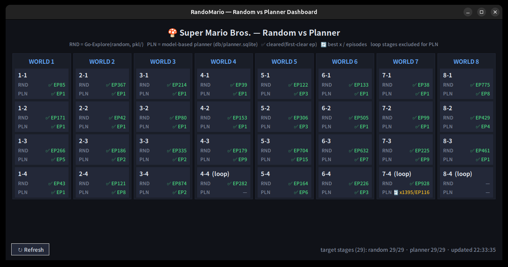
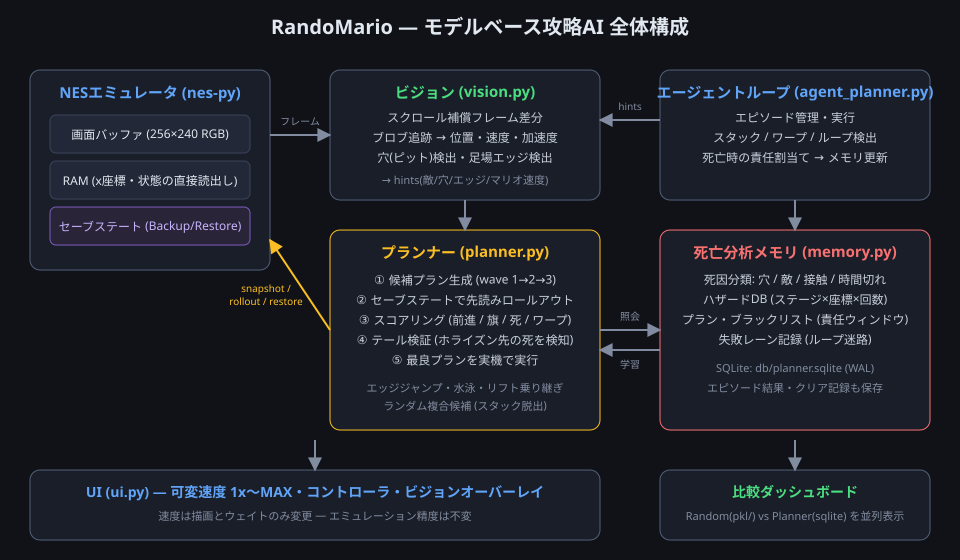
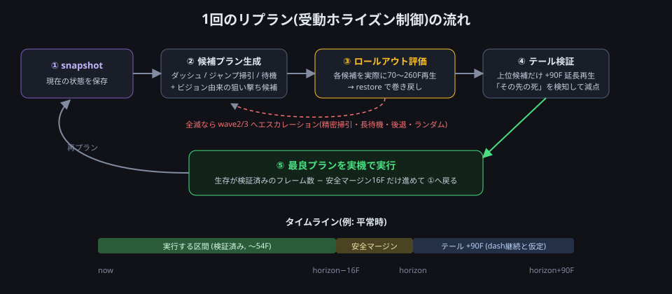
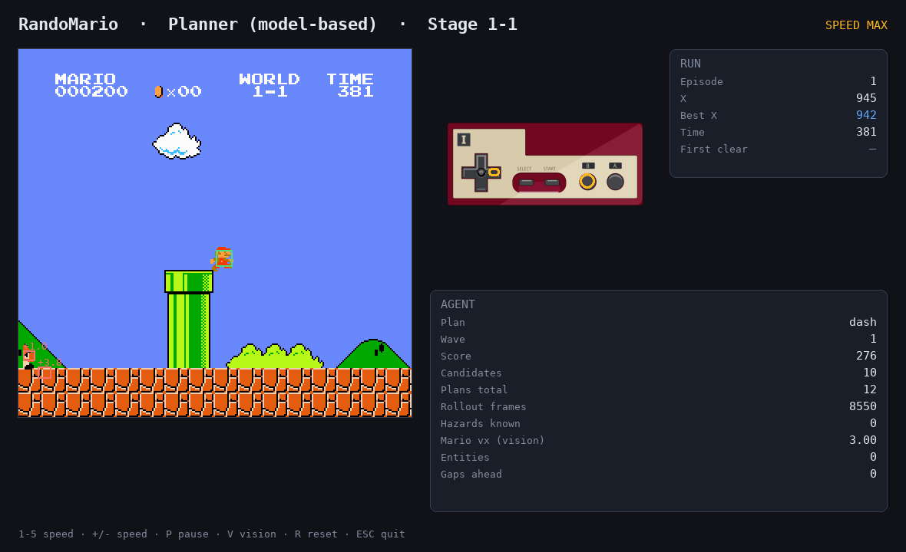
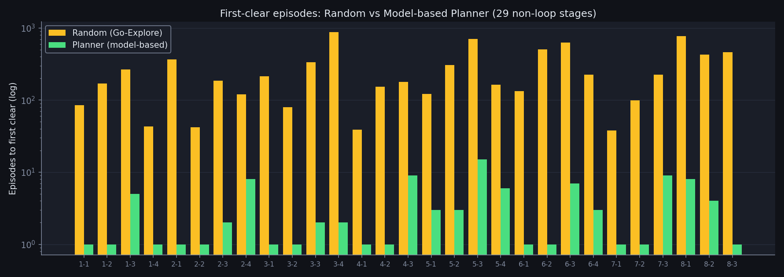

# 「考えるマリオ」を作る — セーブステートMPC × 画像認識 × 死から学ぶメモリで、スーパーマリオの全ステージを攻略した話

RandoMario はもともと、**ランダムなキー入力+Go-Explore** でスーパーマリオブラザーズを攻略するプロジェクトでした。ランダムでも全ステージはクリアできます — ただし 1 ステージあたり **38〜928 エピソード**かかります。

今回、これを**モデルベースの攻略AI(プランナー)**に置き換え、ループ構造のない全29ステージを **ほぼ 1〜9 エピソード**でクリアし、検証まで完了しました。この記事では、その仕組みを設計判断や失敗談も含めて解説します。



*比較ダッシュボード。各ステージの RND(ランダム)/ PLN(プランナー)の初クリアエピソードを並べて表示。*

---

## 目次

1. [全体アーキテクチャ](#全体アーキテクチャ)
2. [心臓部: セーブステート・ロールアウトによるモデル予測制御](#心臓部-セーブステートロールアウトによるモデル予測制御)
3. [画像からの状態推定(ビジョン)](#画像からの状態推定ビジョン)
4. [死から学ぶ — ハザードメモリと責任割当て](#死から学ぶ--ハザードメモリと責任割当て)
5. [ハマりどころと解決策(失敗談)](#ハマりどころと解決策失敗談)
6. [特殊地形への対応](#特殊地形への対応)
7. [高速化と実行中の可変速度](#高速化と実行中の可変速度)
8. [結果](#結果)
9. [未解決: ループ城 7-4](#未解決-ループ城-7-4)
10. [使い方](#使い方)

---

## 全体アーキテクチャ



コードは 1 ファイル・モノリシックだった旧構成(`main.py` 約1100行)を捨て、役割ごとのモジュールに分割しました。

```
mario/
├── env_utils.py      # エミュレータ直結・セーブステート・高速ロールアウト
├── actions.py        # アクションセット定義
├── vision.py         # 画像からの状態推定
├── planner.py        # 候補生成 + ロールアウト評価 (MPC)
├── memory.py         # 死亡分析メモリ + 結果DB (SQLite)
├── agent_planner.py  # 攻略AIのエピソードループ
├── agent_explore.py  # 従来の Go-Explore (ランダム) — 比較用ベースライン
└── ui.py             # 共通 Pygame UI
play.py               # 統合エントリポイント
verify.py             # 全ステージ並列検証
progress_viewer.py    # 比較ダッシュボード
```

重要な設計原則はひとつだけです:

> **ステージ固有のロジックは一切書かない。** ステージごとの知識は、実プレイの死亡から学習した「ハザードメモリ」としてのみ蓄積される。

つまりプランナーは初見のステージでも同じコードで動きます。1-1 も、水中の 2-2 も、ファイアバーの城 1-4 も、大穴だらけの 8-1 も、すべて同一のアルゴリズムで攻略しています。

## 心臓部: セーブステート・ロールアウトによるモデル予測制御

### 「予測モデル」を学習しない、という選択

「過去数フレームから位置・速度・加速度を推定して、次の数十ステップを計画する」を実現する方法は 2 つあります。

1. 物理モデル(またはニューラルネット)で未来を**予測**して計画する
2. エミュレータ自体を世界モデルとして使い、**実際に未来を再生**して計画する

本プロジェクトは **2 のハイブリッド**を採用しました。nes-py エミュレータには `Backup`/`Restore` というセーブステート機構が C++ 側に存在し、しかも**1秒あたり12万回**という事実上ゼロコストで呼べることを実測で確認したからです。決定論的なNESにおいて、これは「完璧な世界モデル」が手に入ることを意味します。

一方で「どんな候補を試すべきか」の生成には、後述する**画像ベースの状態推定**を使います。推定は候補を賢く絞るために、正確なロールアウトは最終判断のために、と役割を分けたハイブリッド構成です。

### リプランのサイクル



数十フレームごとに、次のサイクルを回します。

1. **snapshot** — 現在のエミュレータ状態を保存
2. **候補プラン生成** — 今後 70〜260 フレームぶんの入力列を 10〜50 本生成
   - 基本形: ダッシュ継続 / ジャンプ長掃引(6〜32F)/ 遅延ジャンプ / 歩き / 待機 / 後退
   - ビジョン由来: 「穴の縁で踏み切るジャンプ」「敵との会合点で踏むジャンプ」
   - 状況特化: 水泳ストローク(後述)、リフト乗り継ぎ、エッジジャンプポリシー
3. **ロールアウト評価** — 各候補をエミュレータで実際に再生し、`(前進距離) + 0.5×(最終位置) + 旗ボーナス − 死亡ペナルティ − ワープペナルティ` で採点。死んだ時点で打ち切り、毎回 restore で巻き戻す
4. **テール検証** — 上位候補だけ、プラン終了後さらに 90 フレーム(ダッシュ継続を仮定)再生。「プランのすぐ先に隠れた死」(穴への着地、沈む足場)を検知して減点
5. **実行** — 最良プランを実機で実行。**生存が検証済みのフレーム数から安全マージン16Fを引いた長さ**だけ進めて、次のリプランへ

全候補が死ぬ場合は wave2(ジャンプタイミングの精密掃引、空中で止まって足場に乗る `jumpstop`)、wave3(最長170Fの待機・大きく後退して助走・ランダム複合)へ自動的にエスカレーションします。

### スコアリングの小さな工夫

- **死亡は「遅いほどマシ」**: ペナルティを生存フレーム数で緩和。全滅時でも「一番粘れる」プランを選ぶ
- **ワープゾーン封印**: ロールアウト中にワールド番号が変わったら大幅減点。1-2 の天井ルートからワープゾーンに入って「別ステージのゴールでクリア扱い」になる事故を防ぐ
- **x が詰まったら高さを評価**: 前進できない状況では、足場の上での高度上昇(`+0.4 × Δy`)を加点。これが 4-2 の上昇リフト(乗って待たないと進めない)を解いた

## 画像からの状態推定(ビジョン)

RAMを読めばマリオや敵の位置は正確に取れますが、要件は「**過去数フレームの画像から**位置・速度・加速度を推定する」こと。`vision.py` は生のフレーム(256×240 RGB)だけから以下を推定します。



*実行中のUI。ゲーム画面上に検出結果をオーバーレイ(緑=マリオ、赤=敵+速度ラベル、黄=穴マーカー)。*

### スクロール補償フレーム差分

横スクロールゲームでは、画面全体が動くため単純なフレーム差分は使えません。そこで:

1. 背景が支配的な帯(y=140〜200)を 0〜8px 水平シフトさせて SAD(絶対差の総和)が最小になるシフト量を求める → **カメラのスクロール量**
2. 前フレームをそのぶんずらしてから差分を取る → **動いているものだけ**が残る
3. 連結成分抽出(OpenCV)でブロブ化し、最近傍マッチングで追跡

各トラックは EMA 平滑化した **速度・加速度** を持ちます。マリオの識別には「info の x 変位 − スクロール量 = 画面上の移動量」という運動学的な一致を使い、識別できたらカメラ座標→ワールド座標の較正を更新します。

### 穴と足場エッジの検出

- **穴(ピット)**: 空の帯(y=40〜96)の最頻色を背景色とみなし、地面の帯(y=208〜236)が背景色で貫通している列の連なりを穴と判定。地上・地下・城のどのテーマでも動く
- **足場エッジ**: マリオの**足元の高さ**で右方向に走査し、背景色が始まる位置を「今乗っている足場の右端」とする。木の上や城の足場など、画面最下段の走査では意味がない場面で効く

これらは `hints` としてプランナーに渡り、「**穴の縁ちょうどで踏み切る**」「**敵と会合するタイミングで踏む**」という狙い撃ち候補の生成に使われます。

## 死から学ぶ — ハザードメモリと責任割当て

ロールアウトがあっても死は起きます(ホライズンの外に危険が隠れている場合)。そこで死亡をステージ知識に変換します。

### 死因の分類

実プレイで死んだら、RAM とビジョンから原因を分類します:

| 死因 | 判定 |
|---|---|
| `pit`(落下) | y ビューポートが画面外下 |
| `enemy`(敵) | ビジョンが死亡地点付近に敵トラックを検出 |
| `contact` | それ以外の接触死(ファイアバー等) |
| `timeout` | ゲーム内タイマー切れ |
| `stuck` | 進行不能でエピソード放棄 |
| `loop` | 迷路チェックで巻き戻された(死ではないが記録) |

### ハザードメモリの効果

死亡地点は SQLite の `hazards` テーブルに `(ステージ, x座標, 死因, 回数)` で蓄積され、次のエピソードからは:

- その地点の**280px手前から先読みホライズンを 70F → 120F に拡張**
- 同じ場所で2回死んだら、最初から**精密探索 wave2 で計画**

### 責任割当て(blame assignment)

一番効いたのがこれです。単に「死んだ瞬間のプラン」を出禁にしても学習しません。なぜなら**致命的な選択はもっと前**にあるからです(詳細は次章の失敗談で)。

死亡時には「**死の直前 160 フレーム以内に開始されたすべてのプラン**」をブラックリスト(`(ステージ, プラン開始x, 入力列ハッシュ)`)に登録します。次のエピソードで同じ場所に来ると、そのプランは候補から除外され、**エピソードごとに必ず違う選択**が試されます。5-3 では「同じ穴で3回死ぬ → 4回目に突破」という学習カーブがログにはっきり現れました。

## ハマりどころと解決策(失敗談)

この種のシステムは、理屈どおりに動かない箇所にこそ本質があります。代表的な 4 つを紹介します。

### 1. リセットすると必ず 1-1 が始まる

`SuperMarioBrosEnv` はリセット時にタイトル画面をスキップしながらステージ番号を RAM に書き込みます。ところが**コンソールリセットでは NES の RAM が保持される**ため、前エピソードのタイマー値が残り、「もうゲームは始まっている」と誤判定してステージ書き込みがスキップされ、**どのステージを指定しても 1-1 がロード**されていました。しかも実ステージとターゲットの不一致で「ワープした」と判定され、プランナーが完全に無効化。対策はリセット直後にタイマー RAM (`$07F8-$07FA`) をゼロクリアするだけでした。4ステージが全く同じフレーム数で死ぬ、という不気味なログから発覚した問題です。

### 2. 受動ホライズンの「先送りループ」

「47フレーム走ってからジャンプ」というプランを選びつつ、実行は安全のため先頭12フレームだけ→リプランするとまた「47フレーム先でジャンプ」が選ばれ…… **永遠にジャンプに到達しない**現象です。ロールアウトは正確なので、「生存が検証済みの区間は堂々と実行してよい」という原則に切り替えて解決しました(検証済みフレーム数 − 16F を実行)。

### 3. テール検証が「待機」を優遇するバグ

プラン後の追加再生で死んだ候補を減点する際、当初「総生存フレーム数」でスケールしたため、**ただ長く待つプランほど減点が軽くなる**という逆インセンティブが生まれました。「プラン終了後に何フレーム生き延びたか」でスケールするよう修正。

### 4. 責任ウィンドウの毒(過剰ブラックリスト)

責任割当てを「死亡地点の手前 320px のプラン全部」にしたところ、**手前の穴を正しく越えたジャンプまで出禁**になり、エピソードを重ねるほど下手になる退行が発生(5-3 で最高到達 965 → 658)。ウィンドウを座標ではなく**時間(直前160フレーム)**に変えて解決しました。

## 特殊地形への対応

### 水中(2-2, 7-2)

RAM の swim フラグ(`$0704`)で水中を検知すると、候補セットが**ストローク(Aを2F押して離す)を周期6〜24Fで繰り返す**水泳プランに切り替わります。上昇・立ち泳ぎ・沈下・後退の候補も持ち、どの周期が正解かはロールアウトが決めます。両ステージともエピソード1でクリアでした。

### 広い穴 — エッジジャンプポリシー(クローズドループ候補)

8-1 の大穴は「全力の助走+崖っぷちで踏み切り」が必須で、固定フレーム数の候補では踏切位置が合いません。そこで**ロールアウト中の x 座標に反応するポリシー型候補**を導入しました:

> 「(必要なら back px 後退 →)ダッシュ → **x がエッジ − margin に達した瞬間に**ジャンプ hold F」

ロールアウト中に出力した入力列は記録され、採用時は**その記録をそのまま実機で再生**します(決定論なので完全に一致)。エッジ位置はビジョンの足場エッジ検出・穴検出から取ります。8-1 はこの仕組み+ハザード学習で 8 エピソードでクリアしました。

### リフト・ゴンドラ(3-3, 5-3, 4-2)

- wave3 に「**ホップ → 乗って待つ(40/80F)→ ホップ**」というリフト乗り継ぎ複合候補
- x が進まないときの**高度ボーナス**(上昇リフトに乗ることが正当に評価される)
- 上下移動をスタック判定から除外(リフトで上昇中に「進行不能」と誤判定して打ち切っていた)

### 最後の砦 — ランダム複合候補

決定論的な候補セットには構造的な死角があります(トランポリンのバウンド、変則的な壁登り)。wave2/3 には**ランダムに合成した入力列**(右荷重の重み付きサンプリング、4〜26Fセグメント)を混ぜます。ランダムといっても採用前に必ずロールアウトで検証されるので、**Go-Explore の多様性を MPC の安全性で包んだ**形です。2-1・6-2 などの膠着はこれが破りました。

## 高速化と実行中の可変速度

- エミュレーション実測 **約950fps/コア**。ロールアウトは gym のラッパーを全てバイパスし、`_frame_advance()`+RAM直読み
- **平原の早期採択**: 危険が何もなく全速前進できる候補が見つかったら、残り候補の評価を打ち切り(候補1本・0.07秒でリプラン完了)
- **速度はいつでも変更可能**: 1〜5 キーで 1x/2x/4x/8x/MAX。速度が変えるのは**描画頻度とウェイトだけ**で、エミュレーションは常に1フレームずつ正確に実行(精度に影響ゼロ)。MAX では描画を壁時計30fpsに間引き
- 検証は `verify.py` がステージごとにプロセスを立てて並列実行(SQLite は WAL モードで共有)

## 結果



ループ構造のない**全29ステージをクリア**(4-4 / 7-4 / 8-4 はループ迷路のため対象外)。29ステージ中 **16ステージがエピソード1**(=初見一発)クリアです。

| ステージ | Random | Planner | | ステージ | Random | Planner |
|---|---|---|---|---|---|---|
| 1-1 | EP85 | **EP1** | | 5-1 | EP122 | **EP3** |
| 1-2 | EP171 | **EP1** | | 5-2 | EP306 | **EP3** |
| 1-3 | EP266 | **EP5** | | 5-3 | EP704 | **EP15** |
| 1-4 | EP43 | **EP1** | | 5-4 | EP164 | **EP6** |
| 2-1 | EP367 | **EP1** | | 6-1 | EP133 | **EP1** |
| 2-2 | EP42 | **EP1** | | 6-2 | EP505 | **EP1** |
| 2-3 | EP186 | **EP2** | | 6-3 | EP632 | **EP7** |
| 2-4 | EP121 | **EP8** | | 6-4 | EP226 | **EP3** |
| 3-1 | EP214 | **EP1** | | 7-1 | EP38 | **EP1** |
| 3-2 | EP80 | **EP1** | | 7-2 | EP99 | **EP1** |
| 3-3 | EP335 | **EP2** | | 7-3 | EP225 | **EP9** |
| 3-4 | EP874 | **EP2** | | 8-1 | EP775 | **EP8** |
| 4-1 | EP39 | **EP1** | | 8-2 | EP429 | **EP4** |
| 4-2 | EP153 | **EP1** | | 8-3 | EP461 | **EP1** |
| 4-3 | EP179 | **EP9** | | | | |

ちなみに 6-4 は当初「ループステージ」として除外予定でしたが、実際の SMB のループ迷路は **4-4 / 7-4 / 8-4** で、6-4 は普通の城です。実際に走らせたら 3 エピソードでクリアしました。

## 未解決: ループ城 7-4

7-4 は「正しい高さ(レーン)で連続チェックポイントを通過しないと巻き戻される」迷路城です。以下の汎用機構まで実装しました:

- ループ(大きな x 巻き戻し)の検出とハザード記録
- ループ帯では先読みホライズンを 260F に拡張し、**巻き戻され自体をロールアウト内で観測**して回避
- 巻き戻された際の **y レーンプロファイル**(x 32px刻みの高さ列)を記録し、失敗済みレーンと一致する候補を減点 → エピソード内でレーンを系統的に列挙

それでも 100 以上のレーンを試して未突破です。原因は「3連チェックの**正解レーン列**への信用割当て」がまだ粗いこと。チェック単位でレーンを木探索する機構が次の一手だと考えています。

## 使い方

```bash
# 攻略AIをUI付きで観る(1〜5キーで速度変更、Vでビジョン表示)
uv run play.py --agent planner --stage 1-1

# ヘッドレス最速
uv run play.py --agent planner --stage 8-1 --headless

# ランダム(従来のGo-Explore)
uv run play.py --agent explore --stage 1-1

# 全ステージ並列検証
uv run verify.py

# 比較ダッシュボード(標準ライブラリのみで動作)
python3 progress_viewer.py
```

## まとめ

- **エミュレータのセーブステートは最強の世界モデル。** 予測を学習する代わりに、未来を実際に再生して評価する
- ただし探索空間は膨大なので、**画像ベースの状態推定で候補を賢く絞る**ことと、**死亡からの学習(ハザード+責任割当て)**が不可欠
- 受動ホライズン制御には「先送りループ」「テールの死角」「ブラックリストの毒」など、理屈では気づきにくい罠が多い。**同一条件で同じ死に方を繰り返すログ**は、学習が壊れているサインとして最も重要な観測量だった

ステージ固有のコードを1行も書かずに29ステージ+1(6-4)を攻略できたのは、この3点の組み合わせによるものです。
